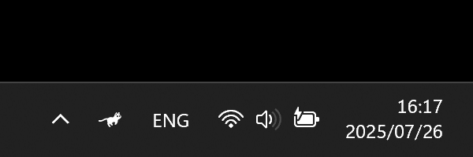

# RunCat 365

**A cute running cat animation on your Windows Taskbar.**

> [!CAUTION]
>
> - This project is for Windows, so we do not accept inquiries about macOS version.
> - We do not accept issues or pull requests in languages other than English.
> - Issues that do not follow the Issue Template will be closed without question.

`C#` `Win32` `.NET 9.0` `Visual Studio` `RunCat`

## Demo

 

 

 

## Installation

RunCat 365 is available for installation on the Microsoft Store.

- Requirement: Windows 10 version 19041.0 or higher
- Microsoft Store: https://apps.microsoft.com/detail/9nw5lpnvwfwj
- Language:
  - Chinese (simplified)
  - Chinese (traditional)
  - English (default)
  - French
  - German
  - Japanese
  - Spanish

## RunCat Developers' Community

This is a space for RunCat contributors to communicate closely regarding development and operations.
We welcome anyone interested in contributing to RunCat.
However, please note that this is a place for discussing features, not for submitting requests.
For requests, please create an Issue according to the template.

Portal: https://runcat-dev.github.io  
Discord: https://discord.gg/wja3mmHt9z

## Contributors

