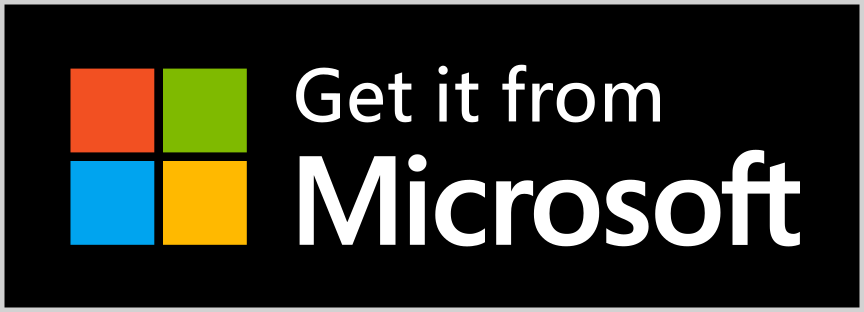
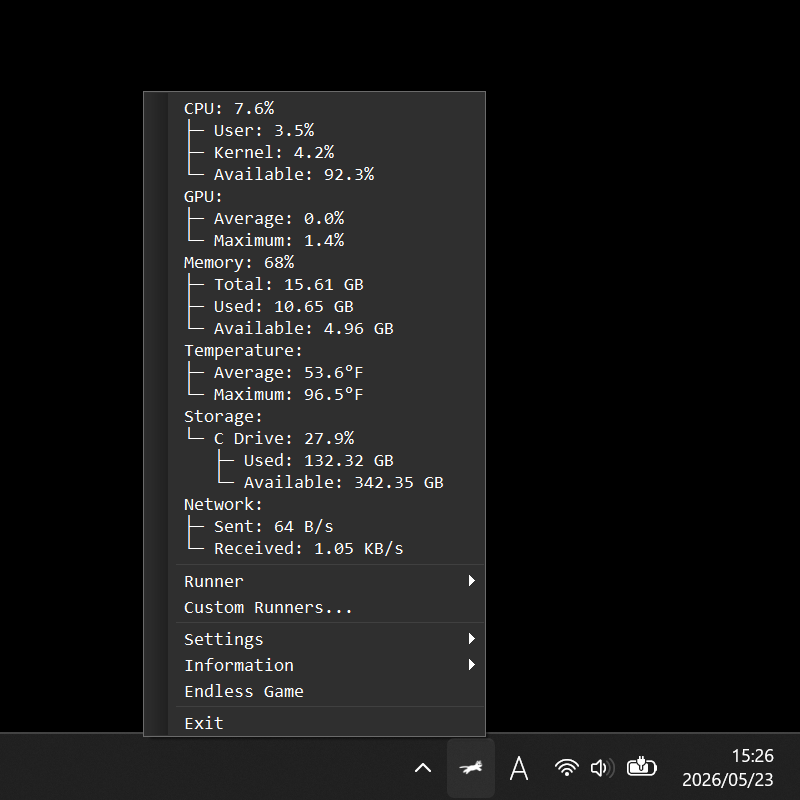
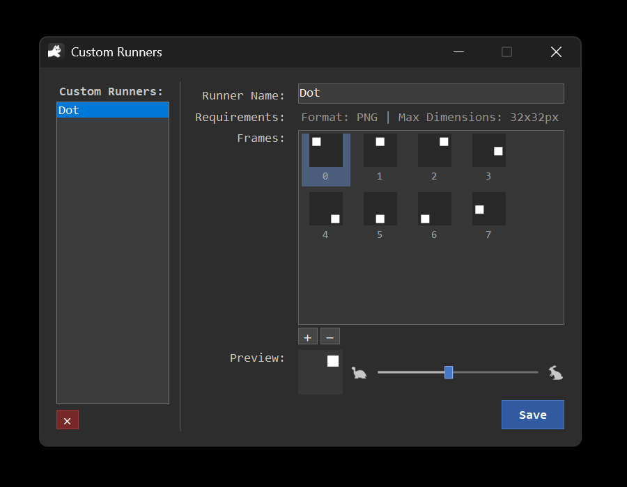
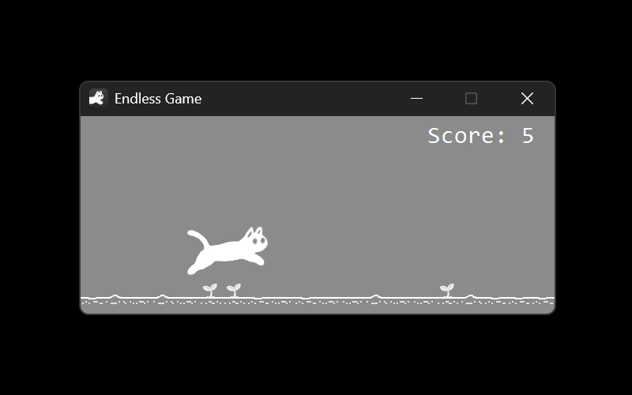

:::header

# RunCat 365

Cat living in the taskbar.
:::

The cat tells you the CPU usage of your device by how fast it runs — one glance at the taskbar is all it takes.

Available on the Microsoft Store · [View on GitHub](https://github.com/runcat-dev/RunCat365)

## Features

~ | [~load] | [~metrics] | [~custom] |
~ | :--- | :--- | :--- |

:::warp load

### 🐈 Load at a glance

The cat speeds up as your CPU gets busier and slows to a stroll when things are calm. No numbers to read — just watch it run.
:::

:::warp metrics

### 📊 Rich system metrics

CPU, GPU, memory, temperature, storage, and network — keep an eye on everything that matters right from the taskbar.
:::

:::warp custom

### 🎨 Make it yours

Build your own runner from original animation frames, or take a break with the built-in mini-game.
:::

## What you can monitor

~ | [~monitor-shot] | [~monitor-list] |
~ | :--- | :--- |

:::warp monitor-shot

:::

:::warp monitor-list
A glance at the taskbar shows you the metrics you care about:

- CPU usage
- GPU usage
- Memory performance
- Machine temperature
- Storage capacity
- Network speed
:::

## Custom runners

Not a cat person? Add your own animation frames and RunCat 365 will run them for you — a parrot, a dog, or anything you can draw.

## A little game

When you need a break, play a simple endless game controlled with nothing but the space bar.

## Languages

RunCat 365 speaks seven languages: English, Japanese, Chinese (Simplified and Traditional), French, German, and Spanish.

## FAQ

:::details What does the running cat actually show?
The cat's running speed reflects your device's CPU usage in real time. When the system is idle it walks slowly; under heavy load it sprints. It is a calm, ambient way to feel how busy your machine is without reading any numbers.
:::

:::details How do I install it?
RunCat 365 is distributed through the Microsoft Store. [Get it here](https://apps.microsoft.com/detail/9nw5lpnvwfwj).
:::

:::details Can I use an animation other than the cat?
Yes. Add your own animation frames to create a custom runner. The active profile is yours to switch at any time.
:::

:::details Is this the same as the original RunCat for macOS?
No. RunCat 365 is the Windows edition, built with Windows Forms and distributed via the Microsoft Store. It shares the spirit of RunCat but is a separate app.
:::

:::details Where do I report a bug or request a feature?
Open an Issue on the [GitHub repository](https://github.com/runcat-dev/RunCat365) following the template. For contributor discussion, the [RunCat Developers community](https://runcat-dev.github.io) is the place to be.
:::

:::footer
[Privacy Policy](./privacy_policy.html) · [GitHub](https://github.com/runcat-dev/RunCat365) · [RunCat Developers](https://runcat-dev.github.io)

**English** · [日本語](./?lang=ja)

© 2022 Takuto Nakamura (Kyome22)
:::
